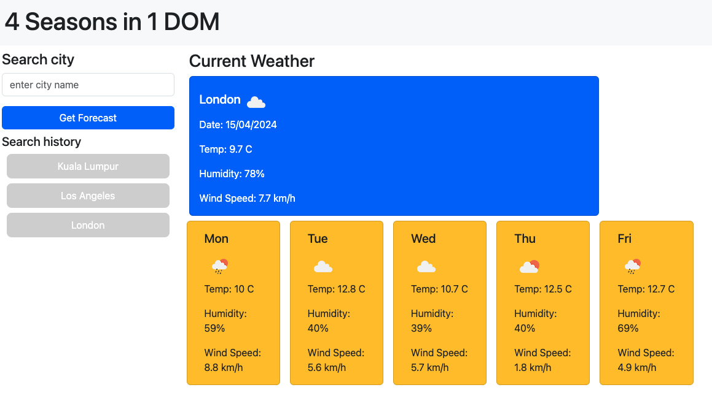

# Bootcamp Challenge 06 - Server Side APIs: Weather Dashboard

## Description

Challenge is to build a weather dashboard with a 5-day forecast that will run in the browser with dynamically updated HTML & CSS.

[User Story](#user-story) and [Acceptance Criteria](#acceptance-criteria) are below.


## Screenshot



## Usage

[Github Pages URL](https://roughnut.github.io/5-day-weather-forecast-dashboard/ "link to deployed site")

## User Story

```md
AS A traveler
I WANT to see the weather outlook for multiple cities
SO THAT I can plan a trip accordingly
```

## Acceptance Criteria

```md
GIVEN a weather dashboard with form inputs
WHEN I search for a city
THEN I am presented with current and future conditions for that city and that city is added to the search history
WHEN I view current weather conditions for that city
THEN I am presented with the city name, the date, an icon representation of weather conditions, the temperature, the humidity, and the wind speed
WHEN I view future weather conditions for that city
THEN I am presented with a 5-day forecast that displays the date, an icon representation of weather conditions, the temperature, the wind speed, and the humidity
WHEN I click on a city in the search history
THEN I am again presented with current and future conditions for that city
```
